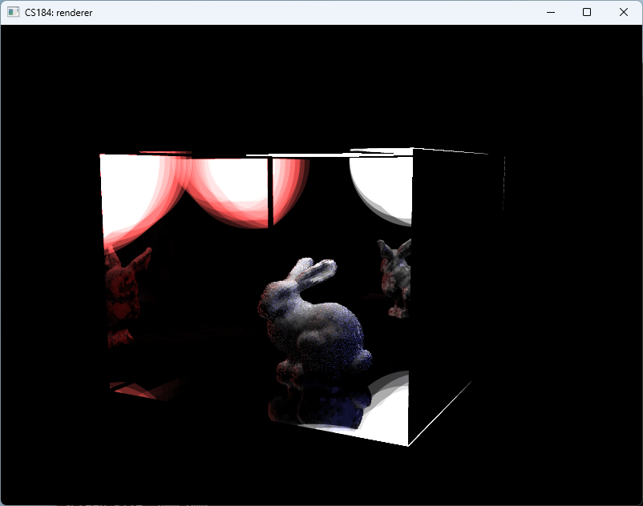

# Lumen-Inspired Real-Time Global Illumination

> 🏆 **Showcase Winner — UC Berkeley CS 184/284A, Spring 2025**

An educational real-time global illumination renderer inspired by techniques described for Unreal Engine 5's Lumen system.

[Final Report](https://jjjasperl.github.io/CS284A_Final_Project/final/) ·
[Official Showcase](https://cs184.eecs.berkeley.edu/sp25/project/showcase/) ·
[Course](https://cs184.eecs.berkeley.edu/sp25/) ·
[Final Slides](https://docs.google.com/presentation/d/17Z62AyyZ5z2muIFhCoKLuutNucc0DL6-/edit?usp=sharing&ouid=118023706164270073581&rtpof=true&sd=true) ·
[Final Video](https://drive.google.com/file/d/1HVseVAh-J4LDwcaLxMnNvZDmEjb_lxWA/view?usp=sharing)

## Overview

This project investigates how signed distance fields, surface caching, radiance caching, and limited-bounce tracing can approximate global illumination at interactive frame rates.

We began with a world-space signed distance field and progressively redesigned the representation around per-mesh distance fields and card-based surface caches. The resulting renderer combines explicit early light transport with cached contributions from more distant bounces.

This is a course research renderer inspired by ideas behind Unreal Engine 5's Lumen. It is not Epic Games' production Lumen implementation, does not run inside Unreal Engine, and is not affiliated with Epic Games.

## Starting Point and Source Availability

The implementation extends the UC Berkeley CS 184/284A Homework 3 path-tracing codebase.

This public repository intentionally contains the project reports, presentation links, video, and rendered results only. Course-derived implementation source is preserved separately in a private archive in accordance with course policy.

## Technical Highlights

- World-space SDF generation using the Jump Flooding Algorithm
- Per-mesh object-space signed distance fields and SDF ray marching
- Card generation using K-Means clustering and PCA-derived oriented bounding boxes
- Surface and radiance caches with directional samples
- Two-bounce tracing combined with cached distant illumination
- Diffuse and ideal mirror material experiments

## Results

| Stage | Reported performance |
| --- | ---: |
| World-space SDF visualization | ~25 FPS |
| Mesh-space SDF visualization | ~160 FPS |
| Surface-cache visualization | ~80 FPS |
| Final CBbunny scene | ~20 FPS |
| Final CBlucy and CBdragon scenes | ~10 FPS |

These measurements were recorded during project development and should be interpreted as project-specific observations rather than standardized benchmarks.

## Team and Contributions

- Jasper Liu
- Jinglun Zhang
- Junming Chen
- Zihan Liao

Jasper Liu contributed throughout project ideation and technical discussions; co-authored the report and presentation slides; participated in experimental analysis and interpretation of performance and quality trade-offs; built and maintained the public project website; and presented the work during the final showcase.

Zihan Liao led the core renderer implementation. The project was developed collaboratively by the four-person team.

## Repository Contents

- [`proposal/`](proposal/) — initial problem formulation and project plan
- [`milestone/`](milestone/) — implementation progress and intermediate results
- [`final/`](final/) — final technical report and result gallery
- [GitHub Release assets](https://github.com/JJJasperl/CS284A_Final_Project/releases/tag/sp25-final-assets) — archived video and supporting deliverables

## Recognition

The project was selected as one of five Showcase Winners from more than 60 Spring 2025 CS 184/284A team projects.

- [Official Spring 2025 Final Project Showcase](https://cs184.eecs.berkeley.edu/sp25/project/showcase/)
- [Final project report](https://jjjasperl.github.io/CS284A_Final_Project/final/)

## References

- Epic Games, [Lumen Technical Details](https://dev.epicgames.com/documentation/en-us/unreal-engine/lumen-technical-details-in-unreal-engine)
- Daniel Wright, Krzysztof Narkowicz, and Patrick Kelly, “Lumen: Real-Time Global Illumination in Unreal Engine 5,” 2022.
- Guodong Rong and Tiow-Seng Tan, “Jump Flooding in GPU with Applications to Voronoi Diagram and Distance Transform,” 2006.
